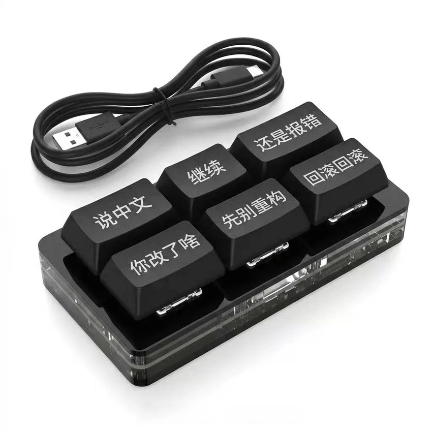

# 🇨🇳 中文 Vibe Coding 输入法

> 专为中文开发者设计的 Vibe Coding 快捷输入工具。按 **F1-F6**，一键输出程序员与 AI 结对编程时的经典语录，自动回车发送。

<p align="center">
  
</p>

*灵感来源：那张在开发者圈子里疯传的 6 键小键盘 meme*

---

## ✨ 功能

| 按键 | 输出内容 | 使用场景 |
|:----:|:---------|:---------|
| **F1** / ⌘⇧1 | `说中文` | 让 AI 用中文回答 / 描述需求 |
| **F2** / ⌘⇧2 | `继续` | AI 生成到一半停了，催它输出 |
| **F3** / ⌘⇧3 | `还是报错` | AI 说修好了，一跑又崩了 |
| **F4** / ⌘⇧4 | `你改了啥` | AI 偷偷改了一堆文件，想看 diff |
| **F5** / ⌘⇧5 | `先别重构` | AI 突然想重写整个项目，赶紧按住 |
| **F6** / ⌘⇧6 | `回滚回滚` | 彻底搞砸了，一键回到上一版本 |

**特点：**
- ✅ 一键输入，**自动回车**
- ✅ 全局生效，在任何输入框都能用（IDE、浏览器、微信、飞书……）
- ✅ 备选快捷键 **Cmd + Shift + 1-6**，无需担心 F1 被系统占用
- ✅ 基于 [Hammerspoon](https://www.hammerspoon.org/)，轻量稳定，随时可改

---

## 📦 安装

### 前置要求

- macOS（Hammerspoon 是 macOS 专用）
- [Homebrew](https://brew.sh/)（推荐，用于安装 Hammerspoon）

### 一键安装

```bash
# 1. 安装 Hammerspoon
brew install --cask hammerspoon

# 2. 克隆配置
git clone https://github.com/virindihk/chinese-vibe-coding-ime.git
mkdir -p ~/.hammerspoon
cp chinese-vibe-coding-ime/init.lua ~/.hammerspoon/init.lua

# 3. 启动 Hammerspoon，记得授权辅助功能
open -a Hammerspoon
```

### 授权辅助功能（必须）

 Hammerspoon 需要「辅助功能」权限才能模拟按键输入。

前往 **系统设置 → 隐私与安全性 → 辅助功能**，将 **Hammerspoon** 加入列表并开启开关。

> 💡 如果列表里已有 Hammerspoon，建议先关闭再打开一次，强制刷新权限。

### 重新加载配置

点击屏幕顶部菜单栏的 Hammerspoon 图标 → **Reload Config**。

看到右上角弹出「中文 Vibe Coding 输入法已启动 ✓」就表示成功了！

---

## ⌨️ 关于 F1-F6

macOS 默认将 F1-F12 作为媒体键（亮度/音量/Mission Control 等）。

| 方案 | 操作 | 效果 |
|:-----|:-----|:-----|
| **A（推荐）** | 系统设置 → 键盘 → 键盘快捷键 → 功能键 → 勾选「将 F1、F2 等键用作标准功能键」 | 直接按 F1-F6 触发 |
| **B** | 直接按 **Fn + F1** ~ **Fn + F6** | 无需改系统设置 |
| **C** | 使用 **Cmd + Shift + 1-6** | 完全不受 F1 媒体键影响 |

---

## 🛠️ 自定义词库

编辑 `~/.hammerspoon/init.lua`，找到 `vibeCodingPhrases`，改成你想要的任何文字：

```lua
local vibeCodingPhrases = {
  F1  = "说中文",
  F2  = "继续",
  F3  = "还是报错",
  F4  = "你改了啥",
  F5  = "先别重构",
  F6  = "回滚回滚",
  -- 可以继续加 F7-F12
  F7  = "再试一次",
  F8  = "写个测试",
}
```

改完后 **Reload Config** 立即生效。

---

## 🖼️ 实际效果

在 Cursor / VS Code / ChatGPT / 微信 / 飞书 等任何输入框中：

1. 按 **F3**
2. 自动输入 `还是报错`
3. 自动按回车发送

全程 0.1 秒，比打字快 10 倍。

---

## 🤝 贡献

欢迎提交 Issue 和 PR！

- 有新的「Vibe Coding 经典语录」？欢迎补充
- 想支持 Windows / Linux 版本？大力欢迎
- 发现 Bug？随时提 Issue

---

## 📄 License

MIT © [virindihk](https://github.com/virindihk)

---

<p align="center">
  <sub>Made with 🧋 and rage against AI hallucinations</sub>
</p>
